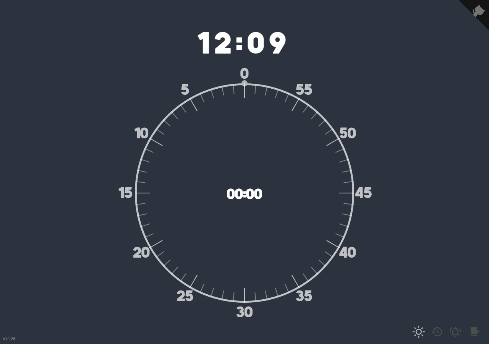

# time-timer [](https://github.com/qoomon/starlines)

### [demo](https://timer.andrewchen.cc)

Time Timer is a single-page visual timer web app, and this fork's headline change is a visible current clock on the timer face. It shows time as a circular disk that fills or empties as the timer runs, supports countdown and countup modes, and includes theme and alarm controls for everyday use.



- Inspired by the physical [Time Timer](https://www.timetimer.com/)
- Built on code from [qoomon](https://github.com/qoomon/time-timer-webapp)

## What The App Does

- Shows a visual circular timer with a moving arc
- Shows the current local clock on the timer face
- Supports both countdown and countup modes
- Lets you drag on the timer face to set the time
- Supports dark/light theme toggle and configurable alarm audio
- Persists timer mode, theme, and alarm settings in local storage
- Supports `?init=<seconds>` URL initialization from `0` to `3600`, for example `?init=900` for 15 minutes

## Local Development

### Requirements

- Node.js 22.x
- npm

### Quick Start

```shell
npm ci
npm run serve
```

Then open the local URL printed by BrowserSync, usually [http://localhost:3000](http://localhost:3000). If port `3000` is already in use, BrowserSync will choose the next available port.

### Other Useful Commands

```shell
# production build into dist/
npm run build

# run Playwright tests
npm test

# show the last Playwright HTML report
npx playwright show-report
```

## Testing During Development

Playwright is the primary automated UI test suite in this repository.

### First-Time Playwright Setup

If you have not installed Playwright browsers on your machine yet, run:

```shell
npx playwright install
```

### Development Validation Flow

1. Run `npm run serve`
2. Open the local BrowserSync URL and manually verify your change
3. Run `npm test` to execute the automated browser tests
4. If a test fails, inspect the HTML report with `npx playwright show-report`

For agent-driven or scripted interactive browser work in this repository, use `playwright-cli` rather than MCP or other browser-tool integrations.

- `playwright-cli open http://127.0.0.1:3000` (or the BrowserSync port printed by `npm run serve`)
- `playwright-cli snapshot`
- `playwright-cli click <ref>`
- `playwright-cli drag <startRef> <endRef>`
- `playwright-cli screenshot`

For the automated test suite, continue to use the Playwright test runner:

- `npx playwright test`
- `npx playwright test tests/<spec>.js`
- `npx playwright show-report`

## Git Hooks

After cloning the repository, you can install the local git hooks:

```shell
./hooks/setup.sh
```

This installs:

- **pre-commit**: Auto-increments the patch version in `package.json`
- **pre-push**: Runs `npm test` before pushing

## Docker

Docker Compose is available as an optional way to run the production build locally from this repository.

```shell
# build and start the service
docker compose up --build

# use a different host port if needed
EXTERNAL_PORT=8080 docker compose up --build
```

The compose setup publishes the app on [http://localhost:9002](http://localhost:9002) by default, or on the port you pass through `EXTERNAL_PORT`.

Optional troubleshooting when you also want a clean local dependency tree for debugging:

```shell
npm ci
```

`npm ci` is usually not required for the containerized flow because the image installs its own dependencies from the lockfile during `docker compose up --build`, but it can help if you are also reproducing local install or test issues on the host.

```shell
# stop the service
docker compose down
```

## Version Management

1. Edit `package.json` and update the `version` field:
   ```json
   {
     "version": "x.x.x"
   }
   ```
2. The version file `app/version.js` is auto-generated and should not be edited manually.
3. The git pre-commit hook automatically increments the patch version on each commit.
